# 大作业(排序算法)要求：
对所有算法(选择排序，归并排序，快速排序，希尔排序，基数排序)进行分析并实现，分析其在不同规模的输入下单机性能变化情况；同时实现对于以下两种输入的排序:
1、对数值的范围在的数组排序，此项任务只能使用C或C++完成。
2、利用多线程实现大规模数据的分布式排序，输入超过100万为最低大规模要求。

# 作业分工

组长郑涵：代码设计与实现

组员鞠凡：readme编写，代码实现

组员王航：ppt编写，代码实现

# 算法简介

## 选择排序

### 原理

第一次从待排序的数据元素中选出最小（或最大）的一个元素，存放在序列的起始位置，然后再从剩余的未排序元素中寻找到最小（大）元素，然后放到已排序的序列的开头。以此类推，直到全部待排序的数据元素的个数为零

### 时间复杂度

平均时间复杂度：O(N2)

最坏时间复杂度：O(N2)

### 空间复杂度

O(1) 

### 稳定性

不稳定

## 归并排序

### 原理

对于一个待排序的数组，首先进行分解，将整个待排序数组以mid中间位置为界，一分为二，随后接着分割，直至到最小单位无法分割；开始进行治的操作，将每两个小部分进行比较排序，并逐步合并；直至合并成整个数组的大小。从而完成了整个排序的过程。

### 时间复杂度

平均时间复杂度：O(NlogN)

最坏时间复杂度：O(NlogN)

### 空间复杂度

O(N) 

### 稳定性

稳定

## 快速排序

### 原理

对于给定的一组记录，选择一个基准元素,通常选择第一个元素或者最后一个元素,通过一趟扫描，将待排序列分成两部分,一部分比基准元素小,一部分大于等于基准元素,此时基准元素在其排好序后的正确位置,然后再用同样的方法递归地排序划分的两部分，直到序列中的所有记录均有序为止

### 时间复杂度

平均时间复杂度：O(NlogN)

最坏时间复杂度：O(N2)

### 空间复杂度

  O(logN) 

### 稳定性

不稳定

## 希尔排序

### 原理

希尔排序是把记录按下标的一定增量分组，对每组使用直接插入排序算法排序；随着增量逐渐减少，每组包含的关键词越来越多，当增量减至1时，整个文件恰被分成一组，算法便终止

### 时间复杂度

平均时间复杂度：O(NlogN)

最坏时间复杂度：O(NlogN)

### 空间复杂度

O(1) 

### 稳定性

不稳定

## 基数排序

### 原理

将所有待比较数值（自然数）统一为同样的数位长度，数位较短的数前面补零。然后，从最低位开始，依次进行一次排序。这样从最低位排序一直到最高位排序完成以后, 数列就变成一个有序序列。

### 时间复杂度

平均时间复杂度：O(P(N+B))

最坏时间复杂度：O(P(N+B))

### 空间复杂度

O(N+B) 

### 稳定性

稳定

# 实现多线程

假设我们要执行一个包含两个阶段的多线程计算，但是我们不希望在完成第一阶段之前进入第二阶段。我们可以使用一种称为屏障（barrier）的同步方法。当线程到达barrier时，它将在barrier处等待，直到所有线程到达barrier，然后它们将一起进行。

如何理解barrier呢？就像和一些朋友一起远足。大家会会记下有多少个朋友，并同意在每个山峰的顶部等彼此。假设你是第一个到达第一个山顶的人，你将在顶部等其他朋友。他们会一一到达顶部，但是直到最后一个人到达之前，没有人会继续走。等所有人都到了之后，大家将继续进行。

Pthreads具有实现该功能的函数pthread_barrier_wait（）。需要声明一个pthread_barrier_t变量，并使用pthread_barrier_init（）对其进行初始化。 pthread_barrier_init（）将将要参与barrier的线程数作为参数。

多线程分布式排序的时候：
快排函数接口和其他算法不一样，单独使用SortWork
其他算法统一使用SortWorkv2

# 单机排序性能测试

## 数据量100000

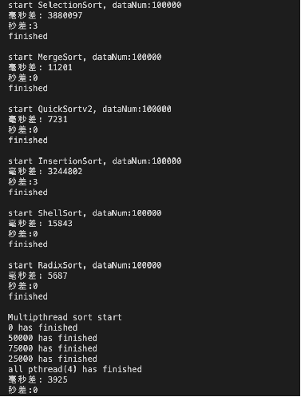

## 数据量10000

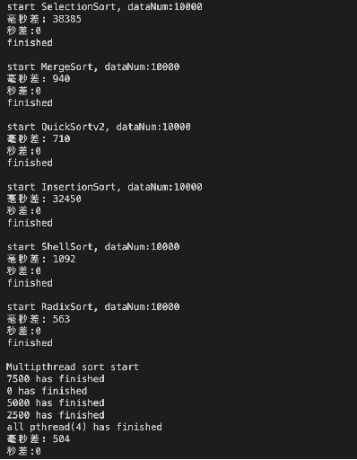

# 多线程性能排序测试

数量100万

## 选择排序

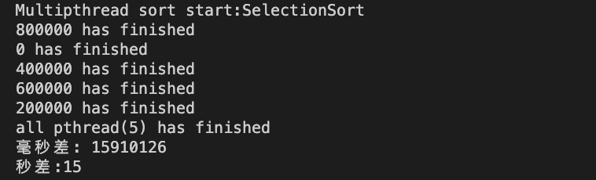

## 归并排序

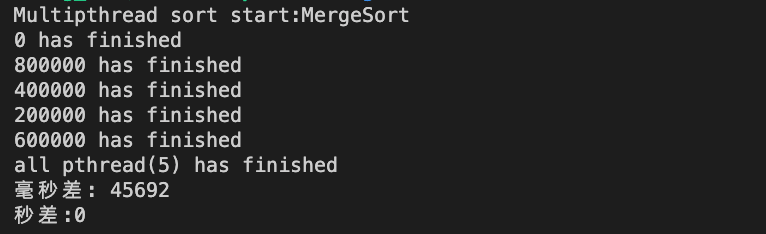

## 快速排序

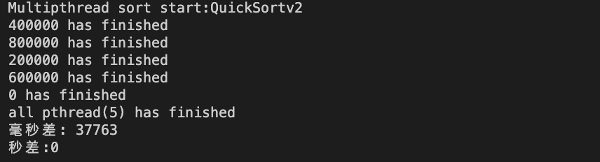

## 希尔排序

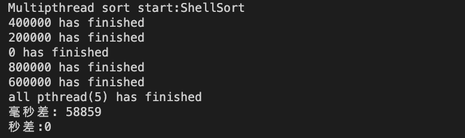

## 基数排序

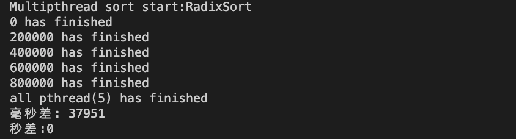

# 大数据排序实现

## 大数实现

定一个结构体 BIGINT

num 字符数组，存数据域

sign   存符号位，0表示负数，1表示正数和0

digit 存位数

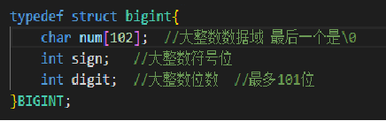

## 比较实现

定一个比较函数，先比符号位，再比位数最后比字符串

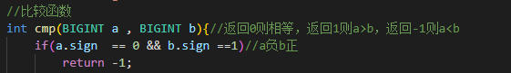

## 基数排序实现

### 整体思路

1.先将数据分成正负两个数组，

2.分别调用子基数排序

3.最后合并输出

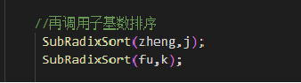

### 子基数排序

在子基数排序中

1.待排序的每个字符串移位补0

2.分桶

3.放回数组

4.移位删0，恢复数据

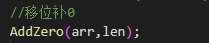

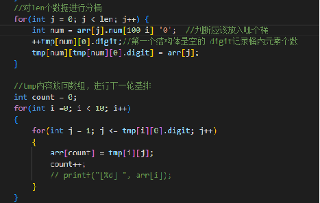

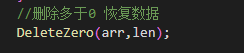

# 注意问题

1、数据量目前最大量级为1e6，1e7会出现栈溢出。还未改用堆内存存储数据
2、文件量很少，未使用makefile。简单使用shell编译即可
3、大数据量验证的时候可使用SortMain >> log 重定向数据查看数据打印，并使用EXCEL排序比对。(需要手动的打开代码中的printf打印)